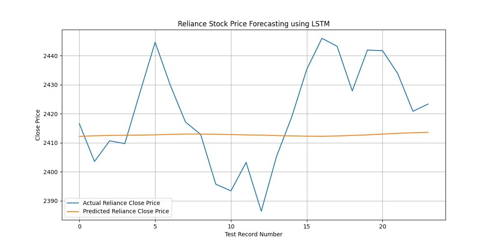
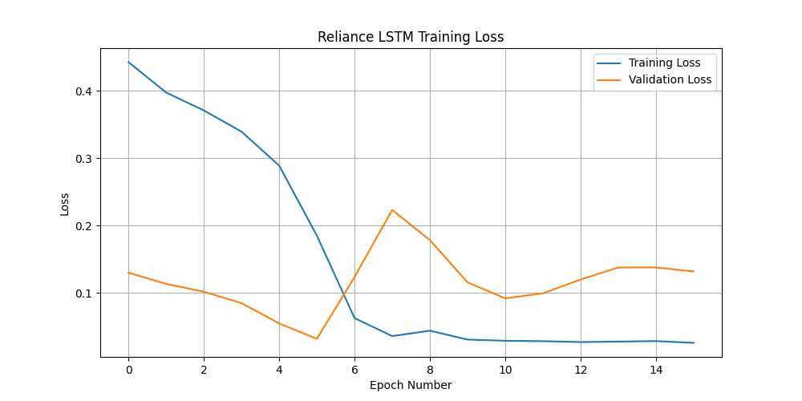

# 📈 AI-Based Financial Time Series Forecasting using LSTM

A deep learning project that forecasts stock prices using a Long Short-Term Memory (LSTM) neural network implemented in PyTorch. The model learns historical price patterns from Reliance Industries stock data and predicts future closing prices.

---

## 📌 Project Overview

Financial markets generate sequential data where past values influence future values. Traditional machine learning models struggle to capture long-term temporal dependencies, making LSTM networks a popular choice for time-series forecasting.

This project demonstrates the complete workflow of:

* Financial data preprocessing
* Min-Max normalization
* Time-series sequence generation
* LSTM architecture design
* Model training and validation
* Future stock price forecasting
* Performance evaluation

---

## ❓ Problem Statement

Can historical stock prices be used to forecast future closing prices using a deep learning-based LSTM sequence model?

---

## 📁 Project Structure

```text
AI-Based-Financial-Time-Series-Forecasting-LSTM/
│
├── Datasets/
│   ├── reliance_stock_sample.csv
│   └── reliance_prediction_output.csv
│
├── Model/
│   └── reliance_lstm_model.pt
│
├── Screenshots/
│   ├── actual_vs_predicted_detailed.png
│   └── training_loss_detailed.png
│
├── AI_Based_Financial_Time_Series_Forecasting_LSTM.py
├── requirements.txt
└── README.md
```

---

## 📦 Installation

```bash
pip install -r requirements.txt
```

---

## 📊 Dataset Information

The project uses historical Reliance Industries stock market data.

### Features

| Feature | Description    |
| ------- | -------------- |
| Date    | Trading Date   |
| Open    | Opening Price  |
| High    | Highest Price  |
| Low     | Lowest Price   |
| Close   | Closing Price  |
| Volume  | Trading Volume |

### Dataset Statistics

| Property        | Value                    |
| --------------- | ------------------------ |
| Total Records   | 130                      |
| Time Period     | January 2024 – June 2024 |
| Forecast Target | Close Price              |

---

## ⚙️ Data Preprocessing

### 1. Date Processing

* Date conversion to datetime format
* Chronological sorting

### 2. Feature Selection

Only the **Close Price** is used for forecasting.

### 3. Normalization

Min-Max Scaling:

$$x_{scaled} = \frac{x - x_{min}}{x_{max} - x_{min}}$$

This scales values between 0 and 1 for stable neural network training.

### 4. Sequence Creation

The model uses the previous **10 trading days** to predict the next day's closing price.

```text
Input  : Day 1 → Day 10
Output : Day 11 Close Price
```

---

## 🧠 LSTM Architecture

| Layer        | Configuration |
| ------------ | ------------- |
| LSTM Layer 1 | 50 Units      |
| Dropout      | 20%           |
| LSTM Layer 2 | 50 Units      |
| Dropout      | 20%           |
| Dense Layer  | 25 Neurons    |
| ReLU         | Activation    |
| Output Layer | 1 Neuron      |

### Total Parameters

```text
32,301 Trainable Parameters
```

---

## 🔬 LSTM Working Principle

LSTM maintains:

* **Hidden State** — Short-Term Memory
* **Cell State** — Long-Term Memory

### Forget Gate

$$f_t = \sigma(W_f[h_{t-1}, x_t] + b_f)$$

### Input Gate

$$i_t = \sigma(W_i[h_{t-1}, x_t] + b_i)$$

### Cell State

$$C_t = f_t \cdot C_{t-1} + i_t \cdot \tilde{C_t}$$

### Hidden State

$$h_t = o_t \cdot \tanh(C_t)$$

---

## 🚀 Training Configuration

| Parameter        | Value    |
| ---------------- | -------- |
| Framework        | PyTorch  |
| Epochs           | 60       |
| Early Stopping   | Enabled (Patience = 10) |
| Batch Size       | 16       |
| Loss Function    | MSE Loss |
| Optimizer        | Adam     |
| Validation Split | 20%      |

---

## 📈 Training Results

> Results may vary slightly between runs due to random weight initialization.

### Early Stopping

Training stopped automatically at Epoch 16 to prevent overfitting.

| Metric                | Value    |
| --------------------- | -------- |
| Training Epochs       | 16       |
| Final Training Loss   | 0.026116 |
| Final Validation Loss | 0.131885 |

---

## 📉 Model Evaluation

### Test Performance

| Metric | Value  |
| ------ | ------ |
| MAE    | 15.44  |
| MSE    | 346.01 |
| RMSE   | 18.60  |

### Interpretation

The model predicts future closing prices with an average error of approximately ₹15.44 on the test dataset.

---

## 📸 Results & Visualizations

### Actual vs Predicted Prices



### Training Loss Curve



---

## 🔮 Next Day Forecast

Using the latest available 10 trading days:

```text
Predicted Next-Day Closing Price: ₹2413.67
```

---

## 🛠️ Technologies Used

* Python
* PyTorch
* NumPy
* Pandas
* Matplotlib
* Scikit-Learn

---

## 🎯 Learning Outcomes

Through this project I learned:

* Financial Time Series Forecasting
* Sequence Data Preparation
* Min-Max Normalization
* LSTM Network Architecture
* Hidden State & Cell State Concepts
* Model Training with PyTorch
* Early Stopping Techniques
* Performance Evaluation Metrics
* Future Price Prediction

---

## 🔮 Future Improvements

* Multi-feature forecasting using Open, High, Low, and Volume
* GRU-based forecasting model
* Bidirectional LSTM
* Hyperparameter tuning
* Longer historical datasets
* Real-time stock market integration
* Web dashboard for forecasting

---

## 👨‍💻 Author

**Atharva Deshmukh**

Python Developer | Machine Learning Enthusiast | Deep Learning & AI Projects

GitHub: https://github.com/datharva142