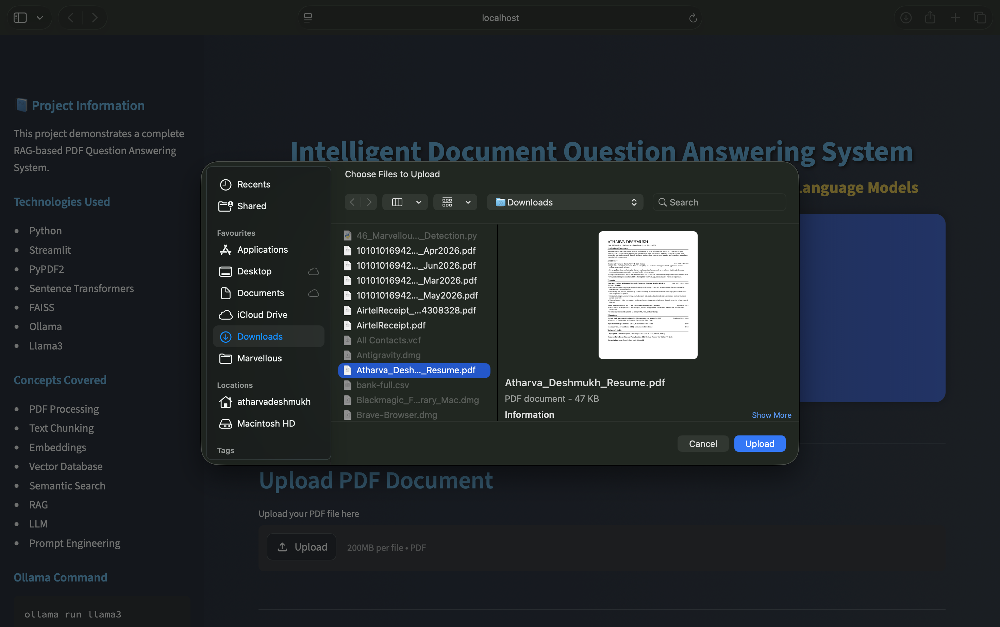
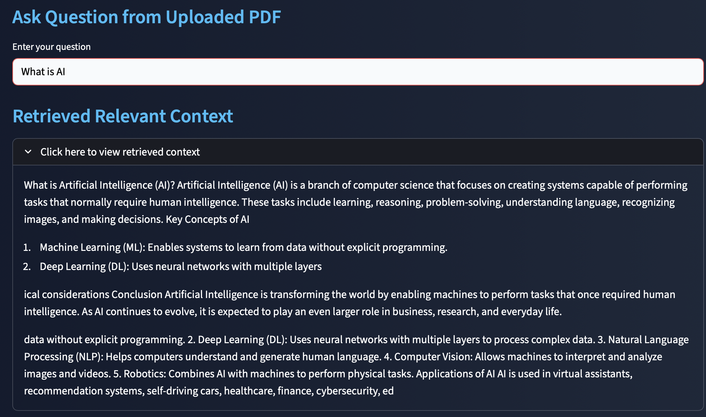
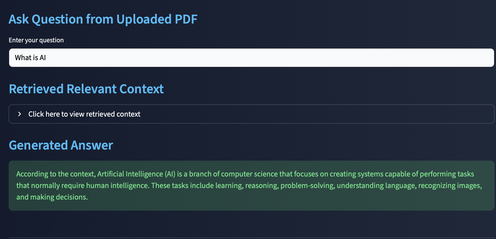
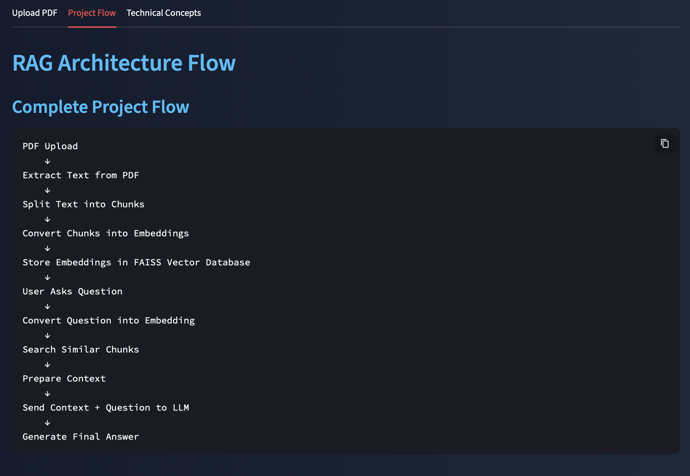

# 📘 AI-Powered PDF Chatbot using RAG and Llama 3

A Streamlit-based Retrieval Augmented Generation (RAG) application that allows users to upload PDF documents and ask questions about their content. The system uses Sentence Transformers for embeddings, FAISS for vector similarity search, and Llama 3 running locally through Ollama to generate context-aware answers.

---

## 🚀 Project Overview

Large Language Models often suffer from hallucinations when answering questions without relevant context.

This project solves that problem using **Retrieval Augmented Generation (RAG)**:

1. Extract text from uploaded PDF documents.
2. Split text into meaningful chunks.
3. Convert chunks into vector embeddings.
4. Store embeddings in a FAISS vector database.
5. Retrieve the most relevant chunks for a user query.
6. Send retrieved context and question to Llama 3.
7. Generate accurate document-based answers.

---

## 📁 Project Structure

```text
Intelligent-Document-QA-System-RAG/
│
├── app.py
├── requirements.txt
├── README.md
│
├── Screenshots/
│   ├── PDF_Upload.png
│   ├── Retrieved_Context.png
│   ├── Generated_Answer.png
│   └── Project_Flow.png
│
└── Sample_PDFs/
```

---

## 🎯 Key Features

* Upload PDF documents
* Automatic text extraction
* Intelligent text chunking
* Sentence Transformer embeddings
* FAISS vector database
* Semantic similarity search
* Retrieval Augmented Generation (RAG)
* Local LLM inference using Ollama
* Interactive Streamlit user interface
* Context-aware question answering

---

## 🔄 RAG Architecture Flow

```text
PDF Upload
    ↓
Extract Text from PDF
    ↓
Split Text into Chunks
    ↓
Generate Embeddings
    ↓
Store in FAISS Vector Database
    ↓
User Question
    ↓
Question Embedding
    ↓
Semantic Search
    ↓
Retrieve Relevant Chunks
    ↓
Create Context
    ↓
Llama 3 via Ollama
    ↓
Generate Final Answer
```

---

## ⚙️ How It Works

### Step 1: PDF Processing

The uploaded PDF is processed using PyPDF2 to extract readable text from all pages.

### Step 2: Text Chunking

Large documents are divided into smaller chunks:

* Chunk Size: 500 Characters
* Overlap: 100 Characters

This helps preserve context while improving retrieval quality.

### Step 3: Embedding Generation

Sentence Transformers model:

```text
all-MiniLM-L6-v2
```

converts each chunk into a dense vector representation.

### Step 4: Vector Database

FAISS stores all embeddings and performs efficient similarity searches.

### Step 5: Semantic Retrieval

When a user asks a question:

1. The question is converted into an embedding.
2. FAISS retrieves the Top 3 most relevant chunks.
3. Retrieved chunks become the context.

### Step 6: Answer Generation

The retrieved context and user question are combined into a prompt and sent to:

```text
Llama 3
```

running locally via:

```text
Ollama
```

to generate the final answer.

---

## 🖥️ Application Tabs

| Tab                | Purpose                                    |
| ------------------ | ------------------------------------------ |
| Upload PDF         | Upload PDF, ask questions, receive answers |
| Project Flow       | Visual explanation of RAG architecture     |
| Technical Concepts | Detailed explanation of technologies used  |

---

## 📸 Screenshots

### PDF Upload Interface



### Retrieved Context



### Generated Answer



### Project Flow



---

## 🧠 Concepts Demonstrated

* Retrieval Augmented Generation (RAG)
* Semantic Search
* Sentence Embeddings
* Vector Databases
* Similarity Search
* Large Language Models (LLMs)
* Prompt Engineering
* Context Retrieval
* Local AI Inference
* Streamlit Applications

---

## 🛠️ Tech Stack

| Technology            | Purpose                   |
| --------------------- | ------------------------- |
| Python                | Core Programming Language |
| Streamlit             | Web Application Framework |
| PyPDF2                | PDF Text Extraction       |
| Sentence Transformers | Embedding Generation      |
| FAISS                 | Vector Database           |
| Ollama                | Local LLM Runtime         |
| Llama 3               | Answer Generation         |
| NumPy                 | Numerical Processing      |
| Requests              | API Communication         |

---

## 🚀 Installation

### Install Dependencies

```bash
pip install -r requirements.txt
```

### Install Ollama

Download Ollama from:

https://ollama.com

### Download Llama 3

```bash
ollama pull llama3
```

### Start Ollama

```bash
ollama serve
```

### Run Application

```bash
streamlit run app.py
```

Open:

```text
http://localhost:8501
```

---

## ⚠️ Important Notes

* Ollama must be running before launching the application.
* Only text-based PDFs are supported.
* Scanned image PDFs may require OCR.
* Answers are generated only from uploaded document content.
* Internet access is not required after model download.

---

## 🔮 Future Improvements

* Support Multiple PDFs
* Chat History Memory
* Source Citation Display
* OCR Support for Scanned PDFs
* DOCX and TXT Support
* Cloud Deployment
* Multi-Model Support (Llama, Gemma, Mistral)
* Agent-Based Workflows

---

## 🎯 Learning Outcomes

Through this project I learned:

* Retrieval Augmented Generation (RAG)
* Vector Databases using FAISS
* Embedding Models
* Semantic Search
* Prompt Engineering
* Local LLM Deployment
* Streamlit Application Development
* End-to-End AI Application Design

---

## 👨‍💻 Author

**Atharva Deshmukh**

Python Developer | Machine Learning Enthusiast | Deep Learning & AI Projects

GitHub: https://github.com/datharva142

---

## 📝 License

This project is open-source and available under the MIT License.
