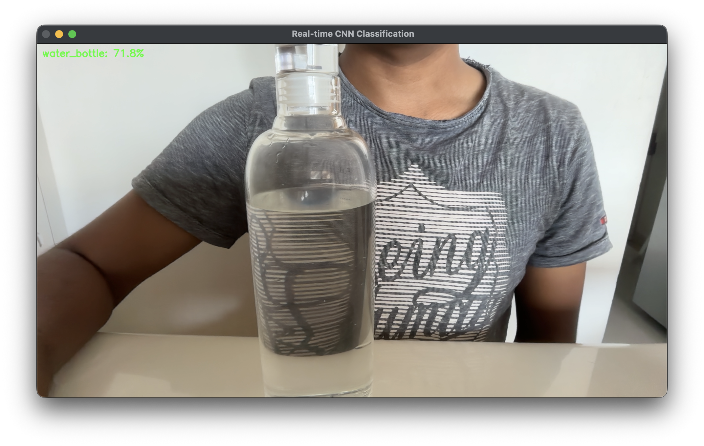

# 📷 Real-Time Image Classification — MobileNetV2 + OpenCV

A computer vision project that performs **real-time object classification** using a webcam. A pre-trained **MobileNetV2** model (trained on ImageNet) identifies objects live from the camera feed and overlays predictions directly on the video stream.

---

## 📌 About The Project

This project uses **Transfer Learning** by leveraging a pre-trained MobileNetV2 model trained on the ImageNet dataset. Instead of training a deep learning model from scratch, the project performs real-time inference on webcam frames and predicts the most likely object present in the scene.

> 💡 This project combines **Deep Learning**, **Computer Vision**, and **Real-Time Inference** using a pre-trained CNN model.

---

## ❓ Problem Statement

**Can real-world objects be classified in real time using a pre-trained deep learning model and a webcam feed?**

---

## 📁 Project Structure

```text
Real-Time-Image-Classification/
│
├── Screenshots/
│   └── Demo.png
│
├── image_classifier.py
├── requirements.txt
└── README.md
```

---

## ⚙️ How It Works

| Step | Description                                        |
| ---- | -------------------------------------------------- |
| 1    | Load MobileNetV2 with pre-trained ImageNet weights |
| 2    | Open webcam using OpenCV                           |
| 3    | Capture video frames continuously                  |
| 4    | Convert BGR → RGB and resize to 224×224            |
| 5    | Preprocess the frame using `preprocess_input()`    |
| 6    | Run CNN inference using MobileNetV2                |
| 7    | Decode the top prediction and confidence score     |
| 8    | Overlay prediction on the video frame              |
| 9    | Display the live video stream                      |
| 10   | Press `q` to exit and release resources            |

---

## 🤖 Model Used

### MobileNetV2 (Transfer Learning)

MobileNetV2 is a lightweight Convolutional Neural Network designed for mobile and real-time applications. It uses **depthwise separable convolutions** to significantly reduce computational cost while maintaining strong classification performance.

| Property        | Value                    |
| --------------- | ------------------------ |
| Architecture    | MobileNetV2              |
| Weights         | ImageNet Pre-trained     |
| Input Size      | 224 × 224 × 3            |
| Output Classes  | 1000                     |
| Dataset         | ImageNet                 |
| Inference Type  | Real-Time Classification |
| Prediction Mode | Top-1 Prediction         |

> This project demonstrates inference using a pre-trained CNN and does not involve model training or fine-tuning.

---

## 🔄 Transfer Learning

This project uses a pre-trained MobileNetV2 model trained on the ImageNet dataset.

Instead of training a CNN from scratch, the model reuses previously learned visual features and performs inference directly on webcam frames.

### Benefits

* Faster development
* No training dataset required
* Real-time performance
* Reduced computational cost
* High accuracy on common objects

---

## 🖥️ Demo

### Real-Time Classification



> The green overlay displays the predicted object class and confidence score for each frame.

---

## 🚀 Getting Started

### 1. Install Dependencies

```bash
pip install -r requirements.txt
```

### 2. Run the Project

```bash
python3 image_classifier.py
```

### 3. Exit the Application

```text
Press 'q' to quit the webcam window.
```

> ⚠️ Ensure your webcam is connected and accessible before running the application.

---

## 📊 Workflow Diagram

```text
Webcam Frame
      ↓
Image Preprocessing
      ↓
MobileNetV2
      ↓
Prediction
      ↓
Decode Class Label
      ↓
Overlay Result
      ↓
Display Live Feed
```

---

## 🎯 Key Concepts Demonstrated

* Convolutional Neural Networks (CNN)
* Transfer Learning
* MobileNetV2 Architecture
* ImageNet Dataset
* Deep Learning Inference
* Real-Time Video Processing
* OpenCV Webcam Integration
* Computer Vision Applications

---

## 🛠️ Tech Stack

* Python 3.x
* TensorFlow / Keras
* OpenCV
* NumPy

---

## ⚙️ Requirements

```text
tensorflow
opencv-python
numpy
```

---

## 🧠 What I Learned

* How pre-trained CNNs can be used for real-time inference
* Understanding Transfer Learning concepts
* MobileNetV2 architecture and its efficiency
* Webcam integration using OpenCV
* Image preprocessing for deep learning models
* Real-time frame-by-frame prediction
* Overlaying predictions on live video streams
* Difference between model training and inference

---

## 🔮 Future Improvements

* Display Top-3 predictions instead of Top-1
* Support image file uploads
* Add confidence threshold filtering
* Integrate YOLOv8 for object detection
* Save predictions with timestamps
* Deploy as a Flask web application
* Build a browser-based version using WebSockets

---

## 👤 Author

**Atharva Deshmukh**

Python Developer | Machine Learning Enthusiast | Deep Learning & AI Projects