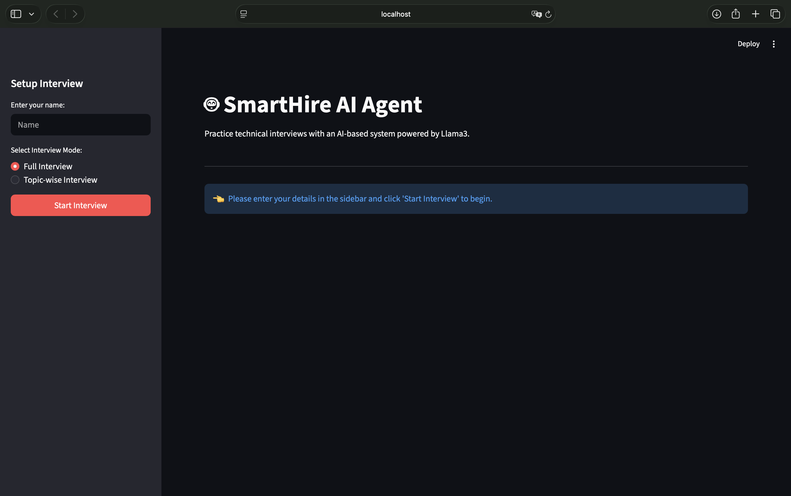
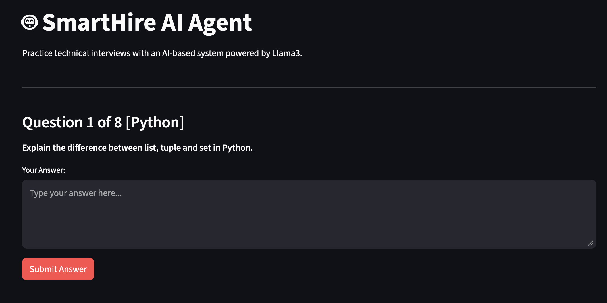
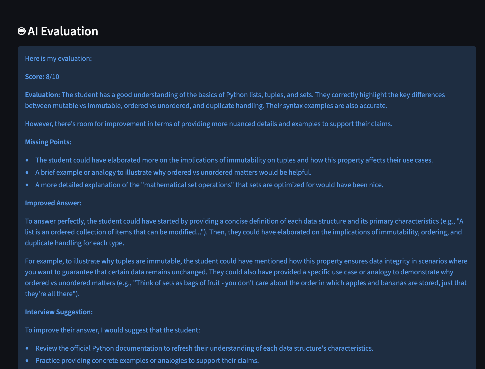
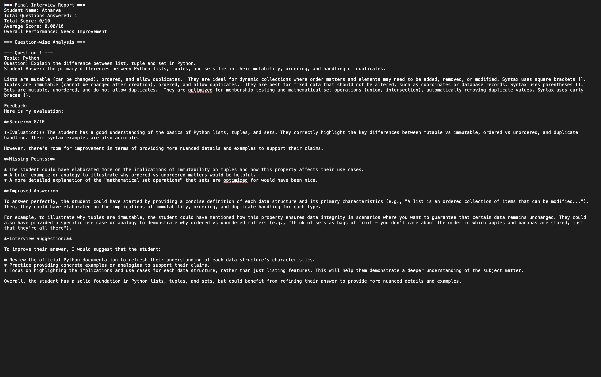

# 📘 SmartHire AI Agent: Text-based Mock Interviewer

A Streamlit-based AI Mock Interview application that allows students to practice technical interviews. The system asks questions from a predefined question bank, accepts student answers, sends those answers to a locally running Llama 3 Large Language Model through Ollama, receives intelligent evaluation, maintains interview history, and generates a detailed interview report.

---

## 🚀 Project Overview

Practicing for technical interviews can be intimidating and lacks immediate, constructive feedback.

This project solves that problem using an **AI Agent**:

1. Select interview mode (Full or Topic-wise).
2. Present a technical question to the student.
3. Accept the student's textual answer.
4. Send the question and answer to Llama 3 with an evaluation prompt.
5. Extract a numeric score and detailed feedback.
6. Maintain an ongoing history of the interview.
7. Generate and save a final performance report.

---

## 📁 Project Structure

```text
SmartHire-AI-Agent/
│
├── app.py                  # Streamlit UI
├── main.py                 # Terminal/CLI entry point
├── interview_agent.py      # Core AI Agent logic (MockInterviewAgent)
├── llm_engine.py           # Handles communication with Ollama/Llama 3
├── report_generator.py     # Generates and saves the final .txt report
├── questions.py            # Predefined question bank
├── requirements.txt        # Project dependencies
├── README.md               # Project documentation
│
└── reports/                # Generated interview reports are saved here
```

---

## 🎯 Key Features

* Interactive Streamlit Web Interface (and Fallback CLI)
* Topic-wise and Full Interview modes
* Diverse question bank (Python, OOP, ML, DL, LLMs, RAG, AI Agents)
* Intelligent Answer Evaluation
* Numeric Score Extraction
* Constructive AI Feedback (Missing points, Improved answers)
* Interview History Memory
* Automated Final Report Generation
* Local LLM inference using Ollama (No API keys needed)

---

## 🔄 AI Agent Architecture Flow

```text
Student Selects Mode
    ↓
Agent Selects Question
    ↓
Student Provides Answer
    ↓
Agent Constructs Prompt
    ↓
Llama 3 via Ollama evaluates Answer
    ↓
Extract Score & Feedback
    ↓
Store in Session History
    ↓
(Repeat for Next Question)
    ↓
End Interview
    ↓
Generate Overall Report
    ↓
Save Report to File
```

---

## ⚙️ How It Works

### Step 1: Initialization
The student launches the app, enters their name, and selects an interview mode (Full or Topic-wise). The `MockInterviewAgent` class is instantiated to hold the state.

### Step 2: Question Prompting
Questions are dynamically loaded from `questions.py` based on the selected topic. The UI presents the current question to the user.

### Step 3: LLM Evaluation
Once the student submits an answer, a highly structured prompt is created. This prompt contains the Topic, Question, and Student Answer.

### Step 4: Local Inference
The prompt is sent via `requests` to a local `Ollama` instance running `Llama 3`. The model responds with:
- Score (out of 10)
- Detailed Evaluation
- Missing Points
- Improved Answer
- Interview Suggestion

### Step 5: Score Extraction & Memory
The agent parses the text response to extract the numeric score using Regular Expressions (Regex). The entire interaction is saved in the agent's history memory.

### Step 6: Final Reporting
When the interview ends, the agent calculates the total score, average score, and overall performance, and compiles it into a final structured text report saved in the `reports/` folder.

---

## 📸 Screenshots

### Home Screen


### Interview Question


### AI Evaluation


### Final Report


---

## 🧠 Concepts Demonstrated

* AI Agents & Agentic Workflows
* Large Language Models (LLMs)
* Prompt Engineering
* Answer Evaluation & Parsing
* Memory & State Management in LLMs
* Local AI Inference
* Python Application Architecture
* Streamlit Web Development

---

## 🛠️ Tech Stack

| Technology | Purpose |
| ---------- | ------- |
| Python | Core Programming Language |
| Streamlit | Web Application Framework |
| Ollama | Local LLM Runtime |
| Llama 3 | Answer Evaluation & Generation |
| Requests | API Communication |
| Regex (re) | Score Parsing |

---

## 🚀 Installation

### Install Dependencies

```bash
pip install -r requirements.txt
```

### Install Ollama

Download Ollama from:
https://ollama.com

### Download Llama 3

```bash
ollama pull llama3
```

### Start Ollama

```bash
ollama serve
```

### Run Application

#### Web Interface (Recommended)
```bash
streamlit run app.py
```
Open: `http://localhost:8501`

#### Terminal Interface
```bash
python main.py
```

---

## ⚠️ Important Notes

* Ollama must be running before launching the application.
* The application is fully local and does not require an internet connection after the model is downloaded.
* Generated reports are saved locally in the `reports/` directory.

---

## 🔮 Future Improvements

* Add Speech-to-Text input for verbal answers
* Add Text-to-Speech to make the agent "speak" the questions
* Dynamic question generation based on previous answers (Adaptive difficulty)
* Cloud Database integration for storing student profiles and progress
* Multi-Model Support (Mistral, Gemma)

---

## 🎯 Learning Outcomes

Through this project I learned:

* AI Agent Design Patterns
* Effective Prompt Engineering for consistent structured outputs
* Local LLM API integration
* Session State Management in Streamlit
* End-to-End Application Development

---

## 👨‍💻 Author

**Atharva Deshmukh**

Python Developer | Machine Learning Enthusiast | Deep Learning & AI Projects

GitHub: https://github.com/datharva142

---

## 📝 License

This project is open-source and available under the MIT License.
