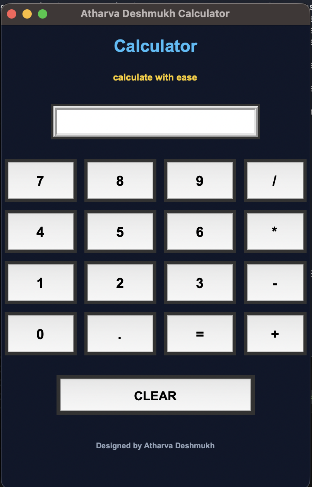

# 🧮 Calculator using Tkinter

A modern desktop calculator application built using Python and Tkinter.

This project demonstrates GUI development, event handling, arithmetic expression evaluation, and user-friendly interface design using Python's built-in Tkinter framework.

---

## 📌 Project Overview

The Calculator application provides a clean graphical user interface that allows users to perform basic arithmetic operations such as:

* Addition
* Subtraction
* Multiplication
* Division
* Decimal Calculations

The application also includes input validation and error handling for invalid mathematical expressions.

---

## 📁 Project Structure

```text
Calculator-Tkinter/
│
├── calculator.py
│
├── Screenshots/
│   └── Demo.png
│
└── README.md
```

---

## 🖥️ User Interface

### Application Features

* Modern Dark Theme
* Interactive Button Layout
* Expression Evaluation
* Error Handling
* Clear Screen Functionality
* Responsive GUI Design

---

## 📸 Application Screenshot



---

## ⚙️ Functional Components

### Number Buttons

Allows users to enter:

```text
0 1 2 3 4 5 6 7 8 9
```

### Arithmetic Operators

Supported operators:

```text
+
-
*
/
```

### Equal Button

Evaluates the entered mathematical expression.

Example:

```text
25 + 15 * 2
```

Output:

```text
55
```

### Clear Button

Removes all entered values from the calculator display.

---

## 🛠️ Technologies Used

* Python
* Tkinter

---

## 🧠 Concepts Learned

* GUI Development
* Event Handling
* Button Widgets
* Entry Widgets
* Layout Management
* Function Callbacks
* Error Handling
* Expression Evaluation

---

## 🚀 Run the Application

### Navigate to Project

```bash
cd Calculator-Tkinter
```

### Run

```bash
python calculator.py
```

---

## 🎯 Learning Outcome

This project demonstrates how to build interactive desktop applications using Python and Tkinter while implementing clean UI design and event-driven programming concepts.

---

## 👨‍💻 Author

**Atharva Deshmukh**

Python Developer | Machine Learning Enthusiast | Deep Learning & AI Projects

GitHub: https://github.com/datharva142
