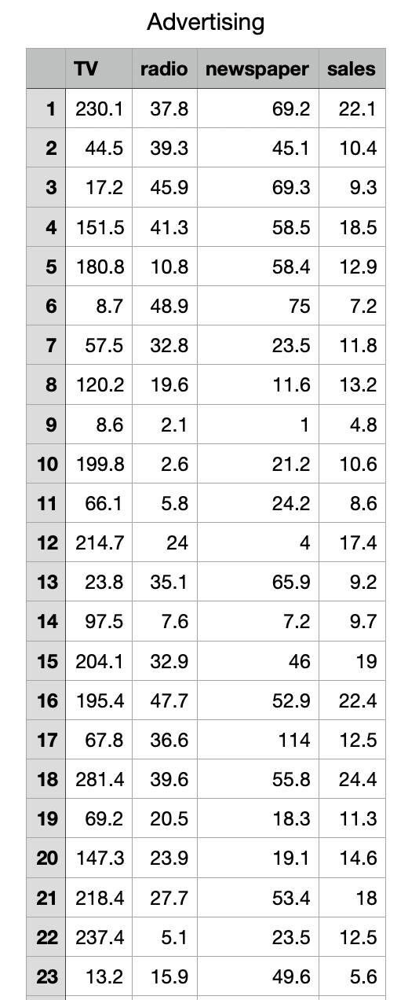
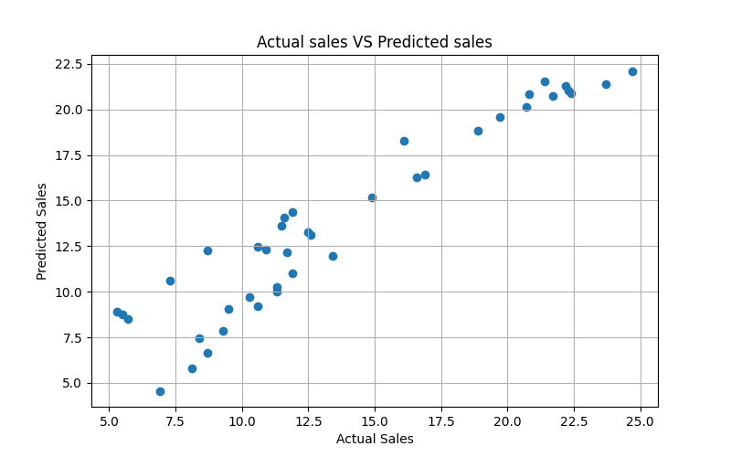

# Advertising Sales Prediction using Linear Regression

## Overview

This project predicts product sales based on advertising expenditure across different marketing channels such as TV, Radio, and Newspaper.

The objective is to analyze the relationship between advertising budgets and sales performance using Machine Learning. A Linear Regression model is trained to estimate future sales based on marketing investments.

---

## Business Problem

Organizations invest heavily in advertising through multiple channels. Understanding how these investments influence sales helps businesses optimize marketing budgets and improve return on investment (ROI).

This project aims to answer the following question:

Can product sales be predicted using advertising spending across TV, Radio, and Newspaper channels?

---

## Dataset Information

The dataset contains advertising expenditure and corresponding sales figures.

| Feature | Description |
|---|---|
| TV | Advertising budget spent on TV |
| radio | Advertising budget spent on Radio |
| newspaper | Advertising budget spent on Newspaper |
| sales | Product sales generated |

Some versions of the dataset may contain an extra column named `Unnamed: 0`, which is removed during preprocessing.

---

## Dataset Preview




---

## Project Workflow

1. Data Loading
   - Load dataset using Pandas
   - Verify dataset structure

2. Data Cleaning
   - Remove unnecessary columns
   - Validate dataset integrity

3. Missing Value Analysis
   - Check for null or missing values

4. Exploratory Data Analysis
   - Generate statistical summaries
   - Analyze feature relationships

5. Correlation Analysis
   - Study relationships between advertising channels and sales

6. Feature Selection
   - Independent Variables: `TV`, `radio`, `newspaper`
   - Dependent Variable: `sales`

7. Train-Test Split
   - 80% Training Data
   - 20% Testing Data

8. Model Training
   - Linear Regression

9. Prediction
   - Predict sales values on unseen test data

10. Model Evaluation
   - Mean Squared Error (MSE)
   - Root Mean Squared Error (RMSE)
   - R2 Score

11. Visualization
   - Actual Sales vs Predicted Sales Scatter Plot

---

## Machine Learning Algorithm

### Linear Regression

Linear Regression is a supervised learning algorithm used to model the relationship between independent variables and a continuous target variable.

In this project, it is used to estimate product sales based on advertising expenditure.

---

## Technologies Used

- Python
- Pandas
- NumPy
- Matplotlib
- Scikit-Learn

---

## Project Structure

```text
Advertising-Sales-Prediction/
│
├── Dataset/
│   └── Advertising.csv
│
├── Screenshots/
│   ├── Dataset_Preview.png
│   ├── Actual_vs_Predicted.png
│
├── advertising_sales_prediction.py
├── README.md
└── requirements.txt