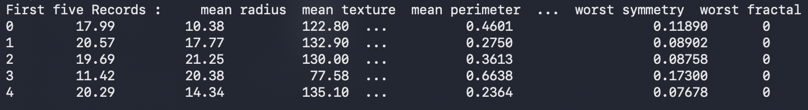
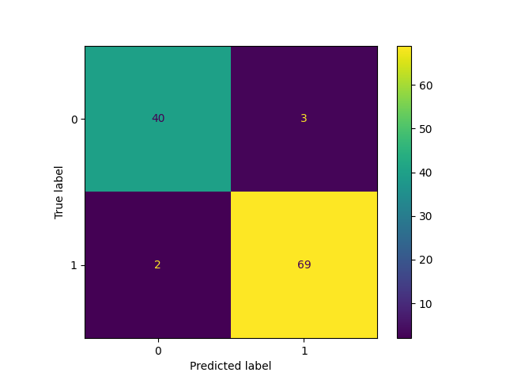
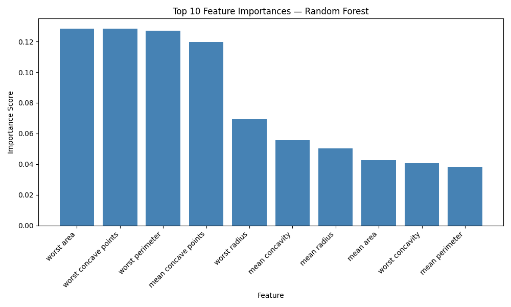
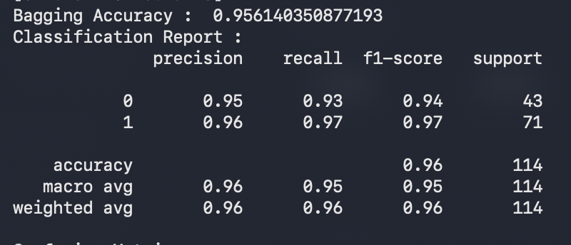

# 🎗️ Breast Cancer Classification — Random Forest & Bagging Classifier

A machine learning project to classify breast cancer tumors as **Benign or Malignant** using ensemble learning techniques.  
Two models are built and compared — a **Bagging Classifier** and a **Random Forest Classifier** — written in a clean **functional programming style**.

---

## 📌 About The Project

Early detection of breast cancer plays an important role in improving treatment outcomes.  
This project uses diagnostic measurements to train ML models that can classify whether a tumor is benign or malignant.

> 💡 Written in **modular / functional programming style** — each step is a separate function for clean, reusable, and testable code.

---

## ❓ Problem Statement

**Can breast cancer tumors be accurately classified using machine learning techniques applied to diagnostic measurements?**

---

## 📁 Project Structure

```
Breast-Cancer-Classification/
│
├── Dataset/
│   └── breast_cancer.csv
│
├── Screenshots/
│   ├── Dataset_Preview.png
│   ├── Model_Performance.png
│   ├── Confusion_Matrix.png
│   └── Feature_Importance.png
│
├── bagging_classifier.py
├── random_forest_classifier.py
├── requirements.txt
└── README.md
```

---

## 🗂️ Dataset Information

| Property | Value |
|----------|-------|
| Total Samples | 569 |
| Total Features | 30 |
| Target Classes | 2 (Benign / Malignant) |
| Missing Values | None |

### Target Variable

| Value | Meaning | Count in Test Set |
|-------|---------|-------------------|
| 0 | Malignant | 43 |
| 1 | Benign | 71 |

### Train-Test Split

| Split | Samples |
|-------|---------|
| Training Set | 455 (80%) |
| Testing Set | 114 (20%) |

### Dataset Preview


---

## ⚙️ Project Workflow

| Step | Description |
|------|-------------|
| 1 | Load dataset and verify integrity |
| 2 | Separate features (`X` — 30 columns) and target label (`Y`) |
| 3 | Split data — 80% Training / 20% Testing |
| 4 | Create base `DecisionTreeClassifier` |
| 5 | Wrap in `BaggingClassifier` (10 estimators) |
| 6 | Also train `RandomForestClassifier` (200 estimators, max_depth=10) |
| 7 | Predict on unseen test data |
| 8 | Evaluate using Accuracy, Classification Report, Confusion Matrix |
| 9 | Visualize Confusion Matrix and Feature Importance |

---

## 🤖 Models Used

### Decision Tree + Bagging Classifier
Bagging (Bootstrap Aggregating) trains multiple Decision Trees on random subsets of data and combines their predictions — reducing variance and overfitting.

### Random Forest Classifier
Random Forest extends Bagging by also randomly selecting features at each split — making trees more diverse and improving overall accuracy.

---

## 📊 Visualizations

### Confusion Matrix


### Feature Importance


### Model Performance


---

## 📈 Model Comparison

| Algorithm | Accuracy | Estimators |
|-----------|----------|------------|
| Decision Tree + Bagging | **95.61%** | 10 |
| Random Forest | **96.49%** | 200 |

> ✅ Random Forest outperforms Bagging by **~0.88%** due to additional feature randomness at each split.

---

## 🔍 Classification Reports

### Bagging Classifier

```
              precision    recall  f1-score   support

           0       0.95      0.93      0.94        43
           1       0.96      0.97      0.97        71

    accuracy                           0.96       114
   macro avg       0.96      0.95      0.95       114
weighted avg       0.96      0.96      0.96       114
```

### Random Forest Classifier

```
              precision    recall  f1-score   support

           0       0.98      0.93      0.95        43
           1       0.96      0.99      0.97        71

    accuracy                           0.96       114
   macro avg       0.97      0.96      0.96       114
weighted avg       0.97      0.96      0.96       114
```

---

## 🧩 Confusion Matrix Breakdown

### Bagging Classifier
```
[[40  3]
 [ 2 69]]
```

| Prediction | Count | Meaning |
|------------|-------|---------|
| True Malignant  | 40 | Correctly identified as malignant |
| True Benign     | 69 | Correctly identified as benign |
| False Benign    |  3 | Malignant tumors missed ⚠️ |
| False Malignant |  2 | Benign tumors incorrectly flagged |

### Random Forest Classifier
```
[[40  3]
 [ 1 70]]
```

| Prediction | Count | Meaning |
|------------|-------|---------|
| True Malignant  | 40 | Correctly identified as malignant |
| True Benign     | 70 | Correctly identified as benign ✅ +1 vs Bagging |
| False Benign    |  3 | Malignant tumors missed ⚠️ |
| False Malignant |  1 | Benign tumors incorrectly flagged ✅ -1 vs Bagging |

---

## 🚀 Getting Started

### 1. Install dependencies
```bash
pip install -r requirements.txt
```

### 2. Run Bagging Classifier
```bash
python3 bagging_classifier.py
```

### 3. Run Random Forest Classifier
```bash
python3 random_forest_classifier.py
```

---

## 🛠️ Tech Stack

- **Python 3.x**
- **Pandas** — Data loading and manipulation
- **NumPy** — Numerical computations
- **Matplotlib** — Plotting visualizations
- **Seaborn** — Confusion matrix heatmap
- **Scikit-learn** — ML models and evaluation metrics

---

## 🧠 What I Learned

- How **Bagging** reduces model variance using bootstrapped subsets
- Difference between **Bagging** and **Random Forest** (feature randomness at each split)
- Writing **modular / functional Python code** — each step as a separate `def`
- Evaluating classification models using **Precision, Recall, F1-Score**
- Interpreting **Confusion Matrix** in a medical context — where false negatives matter more
- Visualizing **Feature Importance** to understand model decisions

---

## 🔮 Future Improvements

- Gradient Boosting & XGBoost Classifier
- Hyperparameter Tuning using GridSearchCV
- Cross-validation for more robust evaluation
- Web deployment using Flask or Streamlit

---

## 👤 Author

**Atharva Deshmukh**  
Python Developer | Machine Learning Enthusiast | Automation & AI Projects