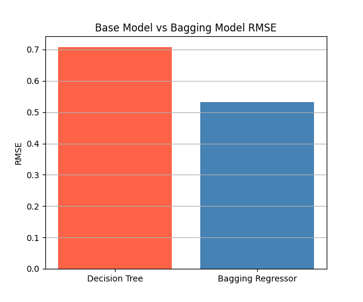

# 🏠 California Housing Price Prediction using Ensemble Learning

A machine learning project to predict California housing prices using multiple ensemble learning techniques.

This project compares:

- Decision Tree Regressor
- Bagging Regressor
- Gradient Boosting Regressor

The objective is to understand how different ensemble methods improve prediction performance compared to a standalone Decision Tree model.

---

## 📌 About The Project

This project uses the California Housing Dataset to predict housing prices based on features such as:

- Median Income
- House Age
- Average Rooms
- Average Bedrooms
- Population
- Average Occupancy
- Latitude
- Longitude

Two ensemble learning approaches are implemented and compared:

### Bagging Regressor

Bagging (Bootstrap Aggregating) trains multiple Decision Trees on random subsets of data and combines their predictions to reduce variance.

### Gradient Boosting Regressor

Gradient Boosting trains Decision Trees sequentially, where each new tree attempts to correct the errors made by previous trees, reducing model bias.

> 💡 This project is written using a modular and functional programming approach where each stage of the machine learning pipeline is implemented as a separate function.

---

## 📁 Project Structure

```text
Housing-Price-Prediction/
│
├── Dataset/
│   └── California_Housing.csv
│
├── Screenshots/
│   ├── Dataset_Preview.png
│   └── Model_Comparison.png
│
├── bagging_regressor.py
├── gradient_boosting_regressor.py
├── requirements.txt
└── README.md
```

---

## ⚙️ Project Workflow

| Step | Description |
|--------|------------|
| 1 | Load California Housing Dataset |
| 2 | Separate Features and Target Variable |
| 3 | Split Dataset into Training and Testing Sets |
| 4 | Train Decision Tree Regressor |
| 5 | Train Bagging Regressor |
| 6 | Train Gradient Boosting Regressor |
| 7 | Generate Predictions |
| 8 | Evaluate using MSE, RMSE, and R² Score |
| 9 | Compare Model Performance |

---

## 🤖 Models Used

### Decision Tree Regressor

A tree-based regression algorithm used as the baseline model.

### Bagging Regressor

An ensemble technique that trains multiple Decision Trees independently on bootstrapped samples and averages their predictions.

### Gradient Boosting Regressor

An ensemble technique that trains trees sequentially, where each tree learns from the errors of previous trees.

---

## 📊 Model Performance

### Decision Tree Regressor

| Metric | Value |
|----------|----------|
| Mean Squared Error (MSE) | 0.4997 |
| Root Mean Squared Error (RMSE) | 0.7069 |
| R² Score | 0.6187 |

---

### Bagging Regressor

| Metric | Value |
|----------|----------|
| Mean Squared Error (MSE) | 0.2827 |
| Root Mean Squared Error (RMSE) | 0.5317 |
| R² Score | 0.7843 |

---

### Gradient Boosting Regressor

| Metric | Value |
|----------|----------|
| Mean Squared Error (MSE) | 0.2940 |
| Root Mean Squared Error (RMSE) | 0.5422 |
| R² Score | 0.7756 |

---

## 📈 Model Comparison

| Model | RMSE | R² Score |
|----------|----------|----------|
| Decision Tree Regressor | 0.7069 | 0.6187 |
| Bagging Regressor | **0.5317** | **0.7843** |
| Gradient Boosting Regressor | 0.5422 | 0.7756 |

### Observation

Bagging Regressor achieved the best performance on the California Housing dataset.

Compared to a standalone Decision Tree:

- RMSE reduced from 0.7069 to 0.5317
- R² Score improved from 0.6187 to 0.7843

Gradient Boosting also performed well but achieved slightly lower performance than Bagging on this dataset.

---

## 📊 Visualization

### Model Comparison



---

## 🚀 Getting Started

### Install Dependencies

```bash
pip install -r requirements.txt
```

### Run Bagging Regressor

```bash
python3 bagging_regressor.py
```

### Run Gradient Boosting Regressor

```bash
python3 gradient_boosting_regressor.py
```

---

## 🛠️ Technologies Used

- Python 3.x
- Pandas
- NumPy
- Matplotlib
- Scikit-Learn

---

## 🧠 What I Learned

- Difference between Regression and Classification problems
- How Decision Trees work for regression tasks
- How Bagging reduces variance through bootstrap sampling
- How Gradient Boosting reduces bias through sequential learning
- Difference between Bagging and Boosting approaches
- Model evaluation using:
  - Mean Squared Error (MSE)
  - Root Mean Squared Error (RMSE)
  - R² Score
- Writing modular and reusable machine learning code
- Comparing multiple machine learning algorithms on the same dataset

---

## 🔮 Future Improvements

- Random Forest Regressor
- XGBoost Regressor
- LightGBM Regressor
- Hyperparameter Tuning using GridSearchCV
- Cross Validation
- Streamlit Dashboard Deployment

---

## 👤 Author

**Atharva Deshmukh**

Python Developer | Machine Learning Enthusiast | Automation & AI Projects