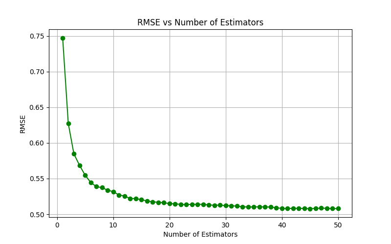

# 🏠 Housing Price Prediction — Bagging Regressor

A machine learning project to predict California housing prices using a **Bagging Regressor** built on top of Decision Trees. This project demonstrates ensemble learning, functional programming style, and model evaluation with visualizations.

---

## 📌 About The Project

This project uses the **California Housing Dataset** to predict house prices based on features like location, income, and house age. A **Bagging Regressor** (Bootstrap Aggregating) is used to reduce variance and improve prediction accuracy over a single Decision Tree.

> 💡 This project is part of my ML learning journey — written in a **modular / functional programming style** to reflect progress in code organization and best practices.

---

## 📁 Project Structure

```
California-Housing-Bagging/
│
├── Dataset/
│   └── California_Housing.csv
│
├── Screenshots/
│   ├── Dataset_Preview.png
│   ├── Learning_Curve.png
│   └── Model_Comparison.png
│
├── california_housing_price_prediction.py
├── requirements.txt
└── README.md
```

---

## ⚙️ How It Works

| Step | Description |
|------|-------------|
| 1 | Load the California Housing dataset |
| 2 | Separate features (`X`) and target label (`Y`) |
| 3 | Split data into training and testing sets (80/20) |
| 4 | Create a base `DecisionTreeRegressor` |
| 5 | Wrap it in a `BaggingRegressor` with 10 estimators |
| 6 | Train and evaluate the model |
| 7 | Compare Bagging vs single Decision Tree using RMSE |
| 8 | Visualize results |

---

## 📊 Visualizations

### Base Model vs Bagging Model (RMSE Comparison)


### Learning Curve (Estimators vs RMSE)



---

## Model Performance

| Metric | Value |
|----------|----------|
| Mean Squared Error (MSE) | 0.2827 |
| Root Mean Squared Error (RMSE) | 0.5317 |
| R² Score | 0.7843 |

The Bagging Regressor was able to explain approximately 78% of the variance in housing prices on the test dataset.

---

## 🚀 Getting Started


### 1. Install dependencies
```bash
pip install -r requirements.txt
```

### 2. Run the project
```bash
python california_housing_price_prediction.py
```

---

## 🛠️ Tech Stack

- **Python 3.x**
- **Pandas** — Data loading and manipulation
- **NumPy** — Numerical computations
- **Matplotlib** — Visualizations
- **Scikit-learn** — ML models and evaluation

---

## 🧠 What I Learned

- How **Bagging** reduces variance by training on random bootstrapped subsets
- Difference between a single Decision Tree and an ensemble model
- Writing **modular / functional Python code** for ML projects
- Evaluating models using MSE, RMSE, and R² Score

---
