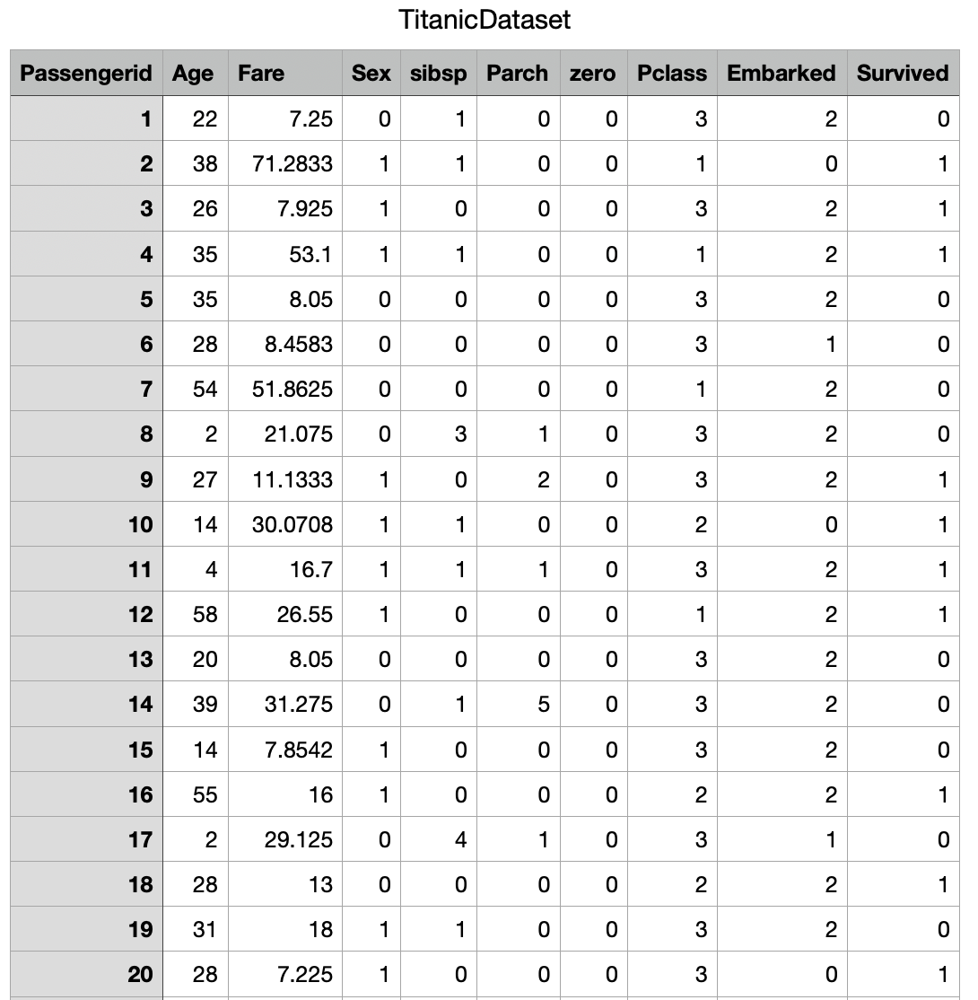
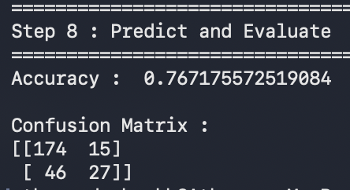

# 🚢 Titanic Survival Prediction — Logistic Regression

A machine learning project to predict passenger survival on the Titanic using **Logistic Regression**.

The project includes a complete machine learning workflow consisting of data preprocessing, missing value handling, feature encoding, model training, model preservation using **Joblib**, model loading, and performance evaluation.

---

## 📌 About The Project

The Titanic dataset contains passenger information such as age, fare, gender, passenger class, and embarkation details.

The objective of this project is to build a classification model capable of predicting whether a passenger survived the Titanic disaster based on available passenger information.

> 💡 This project is implemented using a modular **functional programming approach**, where each step of the machine learning pipeline is organized into separate functions for better readability, maintainability, and reusability.

---

## ❓ Problem Statement

**Can we predict whether a Titanic passenger survived based on demographic and travel-related information?**

This project applies Logistic Regression to classify passengers into:

* Survived (1)
* Did Not Survive (0)

---

## 📁 Project Structure

```text
Titanic-Survival-Prediction/
│
├── Dataset/
│   └── TitanicDataset.csv
│
├── Screenshots/
│   ├── Dataset_Preview.png
│   └── Model_Output.png
│  
│
├── titanic_survival_prediction.py
├── Titanic.pkl
├── requirements.txt
└── README.md
```

---

## 🗂️ Dataset Information

| Property       | Value                 |
| -------------- | --------------------- |
| Total Records  | 1309                  |
| Total Features | 10                    |
| Target Classes | 2                     |
| Problem Type   | Binary Classification |

### Target Variable

| Value | Meaning         |
| ----- | --------------- |
| 0     | Did Not Survive |
| 1     | Survived        |

---

## 📊 Features Used

| Feature      | Description                       |
| ------------ | --------------------------------- |
| Age          | Passenger age                     |
| Fare         | Ticket fare                       |
| Sex          | Gender (0 = Male, 1 = Female)     |
| sibsp        | Number of siblings/spouses aboard |
| Parch        | Number of parents/children aboard |
| Pclass       | Passenger class                   |
| Embarked_1.0 | Encoded embarkation port          |
| Embarked_2.0 | Encoded embarkation port          |

---

## 🧹 Data Preprocessing

The following preprocessing steps were performed:

### Missing Value Handling

| Column   | Strategy          |
| -------- | ----------------- |
| Age      | Median Imputation |
| Fare     | Median Imputation |
| Embarked | Mode Imputation   |

### Columns Removed

| Column      | Reason                                                 |
| ----------- | ------------------------------------------------------ |
| Passengerid | Unique identifier with no predictive value             |
| zero        | Constant-value column containing no useful information |

### Feature Encoding

The `Embarked` categorical feature was converted into numerical features using:

```python
pd.get_dummies()
```

---

## ⚙️ Project Workflow

| Step | Description                               |
| ---- | ----------------------------------------- |
| 1    | Load Titanic dataset                      |
| 2    | Display dataset information               |
| 3    | Handle missing values                     |
| 4    | Remove unnecessary columns                |
| 5    | Encode categorical features               |
| 6    | Split data into training and testing sets |
| 7    | Train Logistic Regression model           |
| 8    | Save trained model using Joblib           |
| 9    | Load saved model                          |
| 10   | Predict passenger survival                |
| 11   | Evaluate model performance                |

---

## 🤖 Machine Learning Algorithm

### Logistic Regression

Logistic Regression is a supervised machine learning algorithm used for binary classification problems.

It estimates the probability that a given input belongs to a specific class using the sigmoid function.

In this project, Logistic Regression predicts whether a passenger survived the Titanic disaster.

### Model Configuration

```python
LogisticRegression(max_iter=1000)
```

---

## 💾 Model Preservation

The trained model is preserved using **Joblib**.

### Save Model

```python
joblib.dump(model, "Titanic.pkl")
```

### Load Model

```python
loaded_model = joblib.load("Titanic.pkl")
```

This allows the model to be trained once and reused later without retraining.

---

## 📈 Model Performance

### Accuracy

```text
76.72%
```

The model correctly classified approximately **76.72%** of the passengers in the testing dataset.

---

## 🔍 Feature Coefficients

| Feature | Coefficient |
| ------- | ----------- |
| Age     | -0.026239   |
| Fare    | 0.000008    |
| Sex     | 1.848569    |
| sibsp   | -0.184580   |
| Parch   | -0.048101   |
| Pclass  | -0.762290   |

### Interpretation

* Female passengers had a significantly higher chance of survival.
* Higher passenger class numbers reduced survival probability.
* Older passengers were slightly less likely to survive.
* Fare had a minor positive impact on survival probability.

---

## 🧩 Confusion Matrix

```text
[[174  15]
 [ 46  27]]
```

### Confusion Matrix Interpretation

| Prediction Type | Count |
| --------------- | ----- |
| True Negatives  | 174   |
| False Positives | 15    |
| False Negatives | 46    |
| True Positives  | 27    |

### Explanation

* 174 passengers who did not survive were correctly classified.
* 27 passengers who survived were correctly classified.
* 15 passengers were incorrectly predicted as survivors.
* 46 passengers who survived were incorrectly classified as non-survivors.

---

## 📸 Screenshots

### Dataset Preview



### Model Output



---


### Move to Project Directory

```bash
cd Titanic-Survival-Prediction
```

### Install Dependencies

```bash
pip install -r requirements.txt
```

### Run Project

```bash
python3 titanic_survival_prediction.py
```

---

## 🛠️ Technologies Used

* Python
* Pandas
* NumPy
* Scikit-Learn
* Joblib

---

## 🧠 Key Learning Outcomes

Through this project, I gained practical experience in:

* Data Cleaning and Preprocessing
* Missing Value Handling
* Feature Encoding
* Binary Classification
* Logistic Regression
* Model Persistence using Joblib
* Model Evaluation
* Confusion Matrix Analysis
* Functional Programming in Python

---

## 🔮 Future Improvements

* Random Forest Classifier Comparison
* Gradient Boosting Classifier Comparison
* Feature Engineering (FamilySize, IsAlone)
* Cross Validation
* Hyperparameter Tuning
* Flask/Streamlit Deployment

---

## 👤 Author

**Atharva Deshmukh**

Python Developer | Machine Learning Enthusiast | Automation & AI Projects
