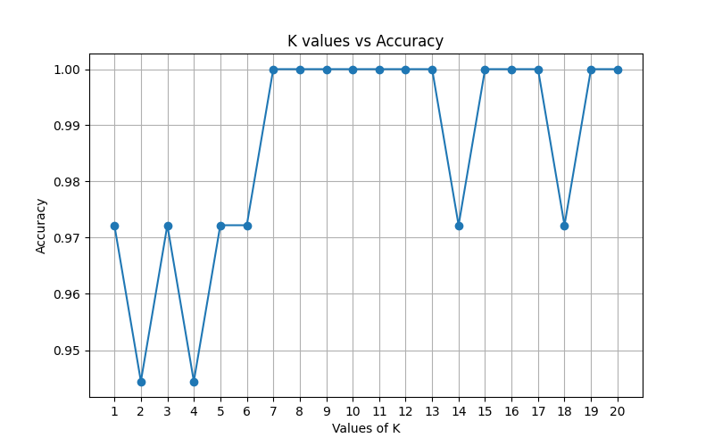
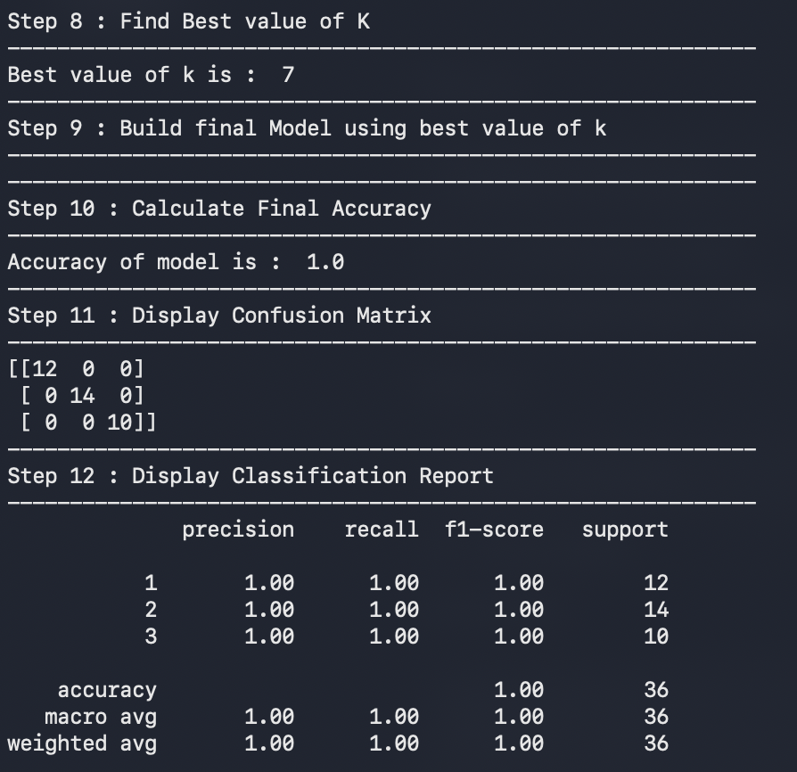

# 🍷 Wine Quality Classification — KNN Classifier

A machine learning project to classify wine types using the **K-Nearest Neighbors (KNN)** algorithm.  
The project includes hyperparameter tuning to find the optimal value of **K**, feature scaling, and full model evaluation — written in clean **functional programming style**.

---

## 📌 About The Project

This project uses the **Wine Dataset** to classify wine into its respective class based on 13 chemical properties.  
The optimal value of K is found by testing all values from 1 to 20 and picking the one with the highest accuracy.

> 💡 Written in **functional programming style** — each step is clearly separated and well-documented for clean, readable code.

---

## ❓ Problem Statement

**Can we classify wine types accurately based on their chemical composition using the KNN algorithm?**

---

## 📁 Project Structure

```
Wine-Classification-Using-KNN/
│
├── Dataset/
│   └── WinePredictor.csv
│
├── Screenshots/
│   ├── Dataset_Preview.png
│   ├── K_vs_Accuracy.png
│   └── Model_Performance.png
│
├── wine_classification_knn.py
├── requirements.txt
└── README.md
```

---

## 🗂️ Dataset Information

| Property | Value |
|----------|-------|
| Total Samples | 178 |
| Total Features | 13 |
| Target Column | `Class` (1, 2, 3) |
| Missing Values | None (after `dropna()`) |
| Train Split | 142 samples (80%) |
| Test Split | 36 samples (20%) |

### Input Features (13 Chemical Properties)

| Feature | Feature | Feature |
|---------|---------|---------|
| Alcohol | Malic acid | Ash |
| Alcalinity of ash | Magnesium | Total phenols |
| Flavanoids | Nonflavanoid phenols | Proanthocyanins |
| Color intensity | Hue | OD280/OD315 of diluted wines |
| Proline | | |

### Target Variable

| Class | Wine Type |
|-------|-----------|
| 1 | Wine Class 1 |
| 2 | Wine Class 2 |
| 3 | Wine Class 3 |

---

## ⚙️ Project Workflow

| Step | Description |
|------|-------------|
| 1 | Load dataset from CSV |
| 2 | Clean dataset — remove rows with missing values |
| 3 | Separate features (`X` — 13 columns) and target label (`Y` = Class) |
| 4 | Train-Test Split — 80% / 20% with `stratify=Y` |
| 5 | Feature scaling using `StandardScaler` |
| 6 | Hyperparameter tuning — test K values from 1 to 20 |
| 7 | Plot K vs Accuracy graph to visualize best K |
| 8 | Find best K — automatically selected as **K = 7** |
| 9 | Build final model using best K |
| 10 | Evaluate — Accuracy, Confusion Matrix, Classification Report |

---

## 🤖 Model Used

### K-Nearest Neighbors (KNN) Classifier
KNN classifies a data point based on the majority class among its **K nearest neighbors** in feature space.  
The choice of K directly affects performance — too small leads to overfitting, too large leads to underfitting.

| Hyperparameter | Value |
|----------------|-------|
| Best K (n_neighbors) | **7** |
| Distance Metric | Euclidean (default) |
| Feature Scaling | `StandardScaler` applied before fitting |

> ⚠️ **Feature scaling is critical for KNN** — without it, features with larger ranges (like Proline: 735–1480) would dominate the distance calculation unfairly over smaller features.

### Why StandardScaler?

KNN is a distance-based algorithm. Features with larger numerical ranges can dominate distance calculations. StandardScaler ensures all features contribute equally to the model.

---

## 📊 Visualizations

### K vs Accuracy Plot


### Model Performance


---

## 📈 Model Performance

| Metric | Value |
|--------|-------|
| Best K | 7 |
| Final Accuracy | **100%** |
| Test Samples | 36 |

### K Values vs Accuracy (1 to 20)

| K | Accuracy | K | Accuracy |
|---|----------|---|----------|
| 1 | 97.22% | 11 | 100.00% |
| 2 | 94.44% | 12 | 100.00% |
| 3 | 97.22% | 13 | 100.00% |
| 4 | 94.44% | 14 | 97.22% |
| 5 | 97.22% | 15 | 100.00% |
| 6 | 97.22% | 16 | 100.00% |
| **7** | **100.00% ✅** | 17 | 100.00% |
| 8 | 100.00% | 18 | 97.22% |
| 9 | 100.00% | 19 | 100.00% |
| 10 | 100.00% | 20 | 100.00% |

> Best K selected as **7** — the first K value to reach 100% accuracy.

---

## 🔍 Classification Report

```
              precision    recall  f1-score   support

           1       1.00      1.00      1.00        12
           2       1.00      1.00      1.00        14
           3       1.00      1.00      1.00        10

    accuracy                           1.00        36
   macro avg       1.00      1.00      1.00        36
weighted avg       1.00      1.00      1.00        36
```

---

## 🧩 Confusion Matrix

```
[[12  0  0]
 [ 0 14  0]
 [ 0  0 10]]
```

| Class | Correctly Classified | Misclassified |
|-------|---------------------|---------------|
| Class 1 (12 samples) | 12 ✅ | 0 |
| Class 2 (14 samples) | 14 ✅ | 0 |
| Class 3 (10 samples) | 10 ✅ | 0 |

> The model achieved a **perfect diagonal confusion matrix** — zero misclassifications across all three wine classes.

---

## 🚀 Getting Started

### 1. Install dependencies
```bash
pip install -r requirements.txt
```

### 2. Run the project
```bash
python3 wine_classification_knn.py
```

---

## 🛠️ Tech Stack

- **Python 3.x**
- **Pandas** — Data loading and cleaning
- **Matplotlib** — K vs Accuracy visualization
- **Scikit-learn** — KNN model, StandardScaler, evaluation metrics

---

## 🧠 What I Learned

- How **KNN** classifies data points using distance to nearest neighbors
- Why **feature scaling is mandatory** for distance-based algorithms like KNN
- **Hyperparameter tuning** — systematically testing K from 1 to 20 to find the best value automatically
- Using `stratify=Y` in train-test split to maintain class distribution across all 3 classes
- Evaluating **multi-class classification** using Confusion Matrix and Classification Report
- Visualizing hyperparameter impact using a **K vs Accuracy line plot**

---

## 🔮 Future Improvements

- Test weighted KNN (`weights='distance'`) for comparison
- Try other distance metrics — Manhattan, Minkowski
- Compare KNN with Random Forest and SVM on the same dataset
- Add cross-validation for more robust K selection
- Web deployment using Flask or Streamlit

---

## 👤 Author

**Atharva Deshmukh**  
Python Developer | Machine Learning Enthusiast | Automation & AI Projects